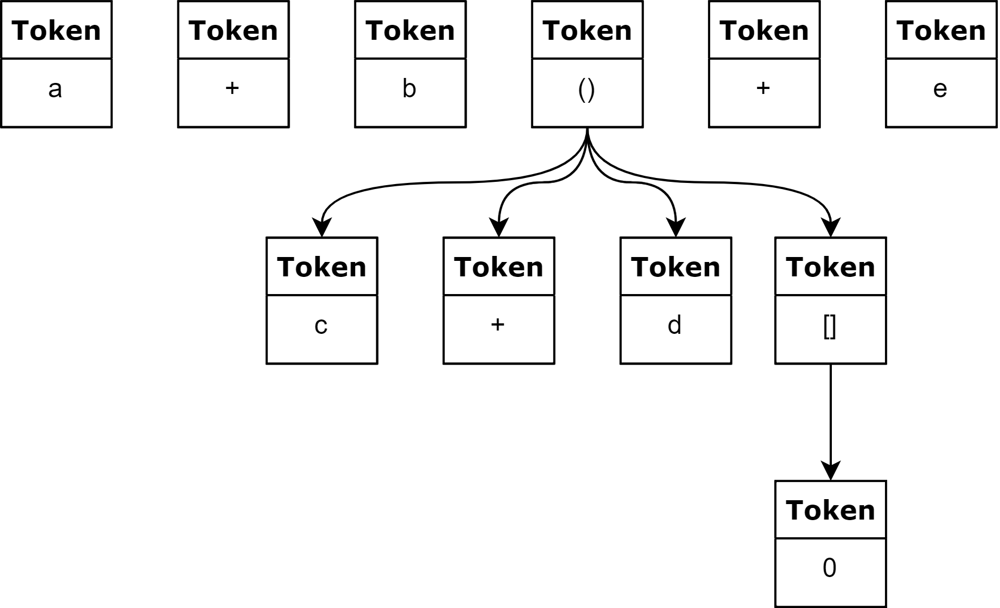
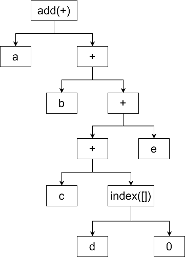
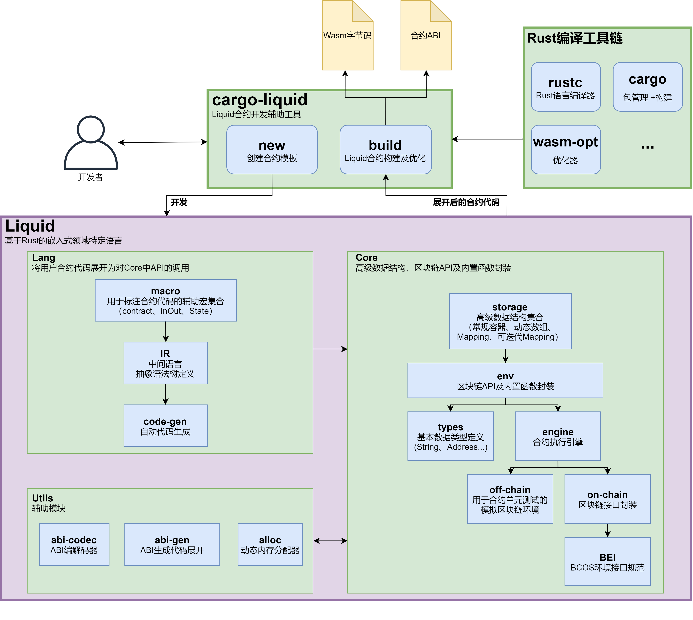

# 实现原理与架构设计

## 实现原理

为理解Liquid的实现原理，我们需要简单了解元编程与宏的概念。在[维基百科](https://zh.wikipedia.org/wiki/%E5%85%83%E7%BC%96%E7%A8%8B)中，元编程被描述成一种计算机程序可以将代码看待成数据的能力，使用元编程技术编写的程序能够像普通程序在运行时更新、替换变量那样操作更新、替换代码。宏在Rust语言中是一种功能，能够在编译实际代码之前按照自定义的规则展开原始代码，从而能够达到在修改原始代码的目的。从元编程的角度理解，宏就是“生成代码的代码”，因而Rust语言中的元编程能力主要来自于宏系统。通过Rust语言的宏系统，不仅能够实现C/C++语言的宏系统所提供的模式替换功能，甚至还能够控制编译器的行为、设计自己的语法从而实现eDSL，而Liquid正是基于Rust语言的宏系统实现的eDSL。我们接下来从“编译器如何处理Rust源代码文件”的问题出发，进一步研究Liquid的实现。

```eval_rst
.. admonition:: 提示

   若您有编译原理相关的知识背景，将有助于理解Liquid的工作机制。
```

Rust源代码文件编译需要经过下列阶段（我们在图中省略了优化等步骤，因为它们并不涉及我们所讨论的主题）：


1. 编译器在获得源代码文件后，会先进行词法分析，即把源代码字符序列转换为标记（Token）序列，标记是单独的语法单元，在Rust语言中，关键字、标识符都能够构成标记。词法分析还会将标记与标记的关系也记录下来，从而的生成标记树（Token tree），以一条简单的程序语句为例：

    ```rust
    a + b + (c + d[0])  + e
    ```

    其标记树如下图所示：

    

    ```eval_rst
    .. admonition:: 注意

       与C/C++中宏处理（展开#include的头文件、替换#define的符号等）是发生在预编译期不同，Rust语言并没有预编译阶段，其宏展开是发生在的完成语法分析后。也正是因为如此，Rust宏能够获得更详细、更复杂的编译器信息，从而能够提供极为强大的功能。
    ```

2. 随即，编译器启动语法分析流程，将词法分析生成的标记树翻译为AST。AST的全称是**A**bstract **S**yntax **T**ree，即抽象语法树。在计算机科学中，AST是源代码语法结构的一种抽象表示，能够方便地被编译器处理。它以树状的形式表现编程语言的语法结构，树上的每个节点都表示源代码中的一种结构。上述第1步中生成的样例标记树会被翻译为如下图所示的AST：

    

3. 然后，编译器开始分析AST并执行宏展开过程。此阶段是是最为重要的阶段，因为Liquid主要工作在这个阶段。以[HelloWorld合约](../quick_start/introduction.md)为例，编译器构造出HelloWorld合约的AST后，当扫描至AST中表示"```#[liquid::contract(version = "0.1.0")]```"的语法树节点时，编译器能够知道，此处正在调用[属性宏](https://doc.rust-lang.org/reference/procedural-macros.html#attribute-macros)（Rust中一种特殊的宏），因此会开始寻找`contract`属性宏的定义并尝试进行宏展开。在Liquid中，`contract`属性宏的定义如下：

    ```rust
    #[proc_macro_attribute]
    pub fn contract(attr: TokenStream, item: TokenStream) -> TokenStream {
        contract::generate(attr.into(), item.into()).into()
    }
    ```

    在上述代码中可以看到，属性宏是以函数的形式定义的，其输入是若干个标记序列（TokenStream），其输出同样是一个标记序列。事实上，在Rust语言中，宏的确可以理解为将某一个AST变换到另外一个AST的函数！只是Rust编译器并不会向属性宏直接传递AST，而且会将其调用位置所在的语法树节点转换为标记序列传递给属性宏，由属性宏的编写者自行决定如何处理这段标记序列。无论如何处理，属性宏都需要返回一段标记序列，Rust编译器接收到这段标记序列后，会将其重新编译为AST插入到原调用位置，从而完成代码编译期更新。

    具体到Liquid的`contract`属性宏，当编译器进行展开时，`contract`属性宏会获取到自身及其后跟随的`mod`（即我们用来定义合约状态及合约方法的模块）的标记序列，并将其解析为一颗AST。随后，`contract`属性宏会自顶向下扫描这颗AST，当遇到使用```#[liquid(storage)] struct ...```语法定义的合约状态时，会进行语法检查及代码变换，将对结构体成员的读写操作变为对链上状态读写接口的调用。同理，在合约代码中使用```#[liquid(event)] struct ...```定义事件、使用```#[liquid(methods)] impl ...```定义合约方法等也会经历同样的代码变换过程，只是变换及桥接到区块链底层平台的方式不尽相同。

4. 编译器将进行宏展开之后的AST翻译为可执行文件：若是需要在本机运行单元测试，则会将AST翻译为本机所使用的操作系统及CPU所能识别的可执行文件格式及二进制代码；若是需要可以在区块链上部署运行，则会将AST翻译为Wasm格式字节码。至此，合约的基本构建流程结束。

从Liquid的实现原理中可以看出，Liquid可以理解为是一种以Rust语言目标语言的编程语言。编译器的广义定义是一种会将某种编程语言写成的源代码转换成另一种编程语言计算机程序，因此实际上Liquid的宏展开过程一定程度上扮演了编译器的角色，从而让您在编写合约时更加便利、自然。如果您对[HelloWorld合约](../quick_start/introduction.md)完全展开后的代码形态感兴趣，可以参考[这里](https://play.rust-lang.org/?version=stable&mode=debug&edition=2018&gist=a2ac3d836b0fdce414e656019b454c82)，您可能会发现这些代码极其晦涩，但幸运的是，您完全不需要和这些代码打交道，Liquid会帮您打理好一切:)。

## 架构设计

Liquid及周边开发工具的整体架构如下图所示：



其中各模块功能如下：

- **cargo-liquid**：方便开发者进行合约开发及构建的命令行工具。开发者在本机安装后`cargo-liquid`能够以`cargo`自定义扩展命令的形式为开发提供服务：

  - 当开发者执行`cargo liquid new ...`命令时，`cargo-liquid`的`new`模块会以[HelloWorld合约](../quick_start/introduction.md)合约为模板创建合约项目，并自动配置编译选项及外部依赖、实现ABI生成器，开发者可以基于该模板进一步开发属于自己的智能合约。

  - 当开发者执行`cargo liquid build ...`命令时，`cargo-liquid`的`build`模块会收集编译元信息（如目标类型等），并调用`rustc`进行跨平台编译，将Liquid合约编译为Wasm格式字节码，随后使用`wasm-opt`等工具对生成的字节码进行效率及体积上的优化，最后调用ABI生成器为开发者的合约生成JSON格式的ABI。

- **Liquid**：嵌入式领域特定语言Liquid的实现，其内部是一组[宏](https://doc.rust-lang.org/reference/macros.html)（Macro）及区块链底层API的集合，以包的形式提供给开发者使用，其内部主要有下列三个子模块：

  - *Lang*：开发者在合约开发过程中所使用到的`contract`（用于以`mod`语法声明智能合约）、`InOut`（用于以`struct`语法定义自定义方法参数类型）等宏均由`macro`模块定义并导出。当构建开发者的合约时，`rustc`会对这些的宏进行匹配及展开。在宏的展开过程中，`IR`模块会解析开发者的代码并重新生成抽象语法树（AST），以对部分Rust语法进行重新诠释。随后，`code-gen`模块会依据`IR`模块生成的AST生成调用`Core`模块的Rust代码，这些代码对开发者并不可见。

  - *Core*：包含了开发者能够使用的智能合约功能的实现。以自底向下的视角来看：
    - `engine`：智能合约的执行引擎。对于上层，`engine`模块提供了一系列基础API，包括用于读取链上存储的`get_storage`接口、用于写入链上存储的`set_storage`接口、用于获取当前区块时间戳的`now`接口等。对于这些接口，`engine`有两种不同的实现：
      - `off-chain`中的实现用于在本机执行智能合约的单元测试时使用，其内部模拟了区块链特性（K-V存储、事件记录器等）并提供了测试专用的接口，用于开发者在正式部署合约前测试合约逻辑是否正确；
      - `on-chain`中的实现用于智能合约真正在区块链中执行时使用，其实现相对较为简单，因为具体实现是由区块链底层平台完成，`on-chain`中只需要声明这些接口并进行适配即可。接口的规范（名称、参数类型、返回值类型等）由区块链底层平台给出，对于FISCO BCOS，这个规范称为BCOS环境接口规范（BCOS Environment Interface，BEI）。关于BEI的具体内容可参考附录。

    - `types`：提供了区块链场景下基本数据类型的定义，如地址（Address）、字符串（String）等。`types`模块与`engine`模块一同构成了智能合约的执行环境，即`env`模块。

    - `storage`：基于`env`模块提供接口，对链上状态的访问方式进行了进一步的抽象。智能合约需要通过`storage`模块提供的容器类型读写链上状态。若要访问单个链上状态，则可以使用常规容器`Value`；若要以下标的形式序列式的访问链上状态，则可以使用向量容器`Vec`；若要以键值对的形式访问链上状态，则可以使用映射容器`Mapping`；若需要在`Mapping`的基础上按键对链上状态进行迭代访问，则可以使用可迭代映射容器`Mapping`。

  - *Utils*：涵盖了其他基础功能。主要包括：用于实现合约方法参数及返回值编解码的`abi-codec`、用于生成ABI生成器代码的`abi-gen`及用于内存分配的`alloc`，其中，`alloc`模块用于为合约注册为全局内存分配器，合约内所有的内存分配操作（动态数组、字符串等）都会通过`alloc`模块进行。
  